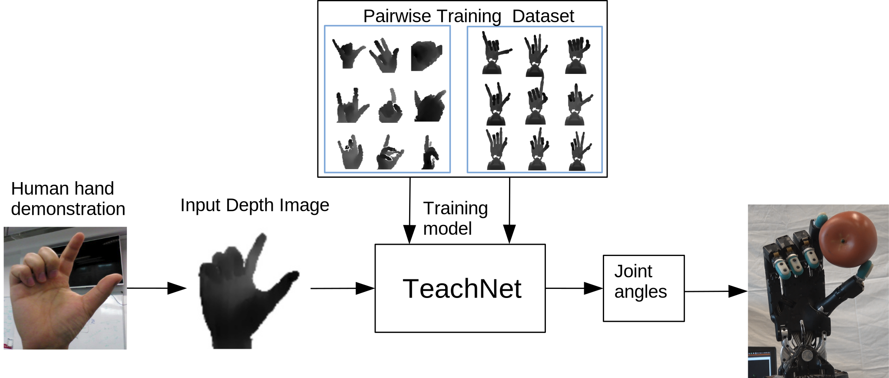
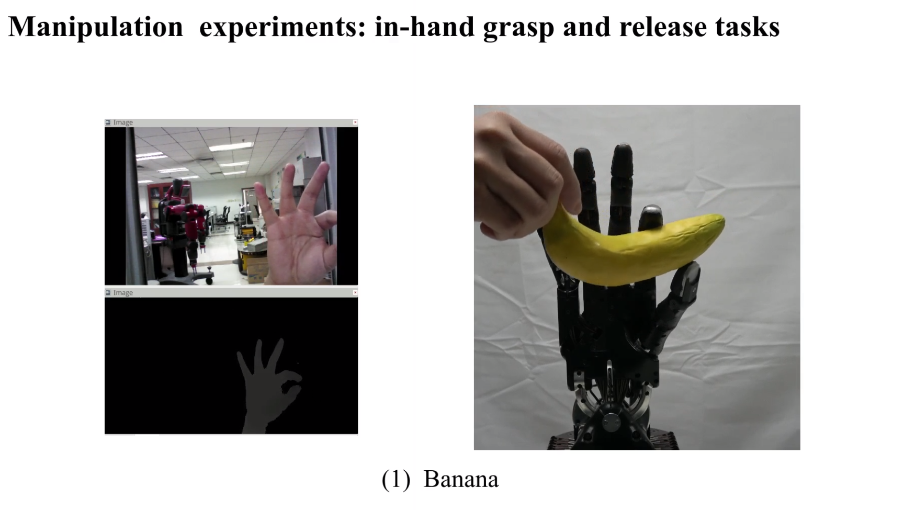

# Vision-based Teleoperation of Shadow Dexterous Hand using End-to-End Deep Neural Network

Venue: ICRA 2019

Author's mail : sli@informatik.uni-hamburg.de, jeasinema@gmail.com


This package produces visually similar robot hand poses based on depth images of the human hand in an end-to-end fashion, which is a collaborative work done by TAMS and Fucun Sun's lab of Tsinghua University.

The special structure of TeachNet, combined with a consistency loss function, handles the differences in appearance and anatomy between human and robotic hands. A synchronized human-robot training set is generated from an existing dataset of labeled depth images of the human hand and from simulated depth images of a robotic hand.

Please cite this paper ([Vision-based Teleoperation of Shadow Dexterous Hand using End-to-End Deep Neural Network](https://arxiv.org/abs/1809.06268)), if you use our released code.



## Video
<a href="https://www.youtube.com/watch?v=I1FTJ87CtDs
" target="_blank"></a>

## Installation Instructions
### OS
  - [ROS Kinetic and Ubuntu 16.04]]
  - [CUDA 9]

### ROS Dependency
  - [bio_ik](https://github.com/TAMS-Group/bio_ik.git)
  - [Moveit](https://github.com/ros-planning/moveit)
  - [common_resources](https://github.com/shadow-robot/common_resources.git)
  - [sr-config](https://github.com/shadow-robot/sr-config.git)
  - [sr_interface](https://github.com/shadow-robot/sr_interface.git)
  - [sr-ros-interface-ethercat](https://github.com/shadow-robot/sr-ros-interface-ethercat.git)
  - [ros_ethercat](https://github.com/shadow-robot/ros_ethercat.git)
  - [sr_common](https://github.com/shadow-robot/sr_common.git)
  - [sr_core](https://github.com/shadow-robot/sr_core.git)
  - [sr-ros-interface](https://github.com/shadow-robot/sr-ros-interface.git)
  - [sr_tools](https://github.com/shadow-robot/sr_tools.git)
  - [ros_control_robot](https://github.com/shadow-robot/ros_control_robot.git)
  - [ros_numpy](https://github.com/eric-wieser/ros_numpy)
  - realsense2_camera
### Python Dependency
- python3.8 (for the demo_teachnet.py and the other pytorch trainning)
- python2.7 (for the ROS stuff and demo_moveit.py, demo_robot_safe.py, and demo_robot_unsafe.py)
- PyTorch
- numpy
- tensorboard
- matplotlib
- pickle
- pandas
- seaborn
- numba
- rospkg
- opencv-python

### Camera Drive
- librealsense

## Setup
- Install necessary packages (kinetic branch) for Shadow Hand.
- Install Bio IK packages. Please follow the Basic Usage
 in [README.md](https://github.com/TAMS-Group/bio_ik/blob/master/README.md) in bio_ik repository and set correct kinematics solver.
- Install RealSense Camera package:
  ```
  sudo apt install ros-kinetic-realsense-camera
  ```
- To simplify it, you can put above packages in one ros workspace.
- Download our package in same workspace, then build this package with catkin_make.

## Dataset Generation
- Download ([BigHand2.2M dataset](http://icvl.ee.ic.ac.uk/hands17/challenge/)). Put the lable file ```Training_Annotation.txt``` into ```ros/src/shadow_teleop/data/Human_label/```. Building nine folders respectively called ```depth_shadow[1-8]``` saves robot depth images from nine viewpoint in```ros/src/shadow_teleop/data/```.
- Generate robot mapping file by human hand keypoints from BigHand2.2M dataset. The generated file save in ```ros/src/shadow_teleop/data/human_robot_mapdata.csv```.
  ```
  python ros/src/shadow_teleop/scripts/human_robot_mappingfile.py
  ```
- Run shadow hand in gazebo and use the our simulation world (./ros/src/teleop_motorhand/worlds/shadowhand_multiview.world).
  ```
  roslaunch teleop_motorhand gazebo.launch
  ```
- Generate dataset by running the code:
  ```
  roslaunch shadow_teleop multi_shadow_sim_bio.launch
  ```
   Please note the location of saved depth images and the location of robot_joints_file.csv.
- Save ```robot_joints_file.csv``` as ```joint_all.npy``` by ```pandas.readcsv()``` or ```numpy.loadtxt()```.
- Crop human hand images into 100*100 (normalized to [0,255)):
  ```
    python ros/src/shadow_teleop/scripts/depth_image_crop.py
  ```
  ```
    python utils/seg_depth.py
  ```
- Crop shadow images into 100*100(normalized to [0,255)):
  ```
    python utils/seg_depth.py
  ```
   Please change the location of original depth images and cropped depth images ```fl``` to your own dataset location.
- Last but not least, spilt ```joint_all.npy``` into training dataset and test dataset by yourself, and save as ```joint_train.npy``` and ```joint_test.npy``` at your own dataset location.

## Model Training
- If you want to train the network yourself instead of using a pretrained model, follow below steps.

- Launch a tensorboard for monitoring:
    ```bash
    tensorboard --log-dir ./assets/log --port 8080
    ```

    and run an experiment for 200 epoch:
    ```
    python main.py --epoch 200 --mode 'train' --batch-size 256 --lr 0.01 --gpu 1 --tag 'teachnet' --data-path 'LOCATION OF YOUR TRAINING DATASET'
    ```

    File name and corresponding experiment:
    ```
    main.py                    --- Teach Hard-Early approach
    main_baseline_human.py     --- Single human
    main_baseline_shadow.py    --- Single shadow
    main_gan.py                --- Teach Soft-Early approach
    ```

## Pretrained Models:
- creat a folder called "weights" under './'
- Download [pretrained models](https://tams.informatik.uni-hamburg.de/people/sli/data/TeachNet_model/) for real-time test.
- put the [pretrained models](https://tams.informatik.uni-hamburg.de/people/sli/data/TeachNet_model/) into "weights" folder


## RealsenseF200 Realtime Demo
- Launch camera RealsenseF200 (If you use the other camera which is suitable for close-range tracking, please use corresponding launch file). Or you can download the recorded [example rosbag](https://tams.informatik.uni-hamburg.de/people/sli/data/TeachNet_model/), and play the bag file:
  ```
  roslaunch realsense2_camera rs_rgbd.launch
  or
  rosbag play [-l] example.bag
  ```
 - Limit your right hand to the viewpoint range of [30&deg;, 120&deg;] and the distance range of [15mm, 40mm] from the camera.

 - Change the correct topic name in demo_teachnet.py based on your camera.

- Run the testing of TeachNet on python3 enviroment
   ```
  python demo_teachnet.py [--model-path pretrained-model-location --cuda --gpu 0]
  ```

 ### Demo in simulation
- Run Shadow hand in simulation
   ```
  roslaunch teleop_motorhand demo.launch
  ```
- Run the demo code on python2 enviroment
  ```
  python demo_moveit.py
  ```
 ### Demo in real world.
 We provide safe mode demo and unsafe mode demo (demo_robot_safe.py and demo_robot_unsafe.py).
The unsafe mode uses the SrHandCommander and doesn't check collision, so the response of the robot is fast and low latency.
- Run the real robot

Safe mode:

- Run the collision check service:
  ```
  rosrun shadow_teleop interpolate_traj_service
  ```
 - Run the demo code on python2 enviroment
   ```
  python demo_robot_safe.py
  ``` 
Unsafe mode:

 - Run the demo code on python2 enviroment
   ```
  python demo_robot_unsafe.py
  ```  
## Citation
If you use this work（collobrated with  ）, please cite:

```plain
@inproceedings{li2018vision,
  title={Vision-based Teleoperation of Shadow Dexterous Hand using End-to-End Deep Neural Network},
  author={Li, Shuang and Ma, Xiaojian and Liang, Hongzhuo and G{\"o}rner, Michael and Ruppel, Philipp and Fang, Bing and Sun, Fuchun and Zhang, Jianwei},
  booktitle={IEEE International Conference on Robotics and Automation (ICRA)},
  year={2019}
}
```
